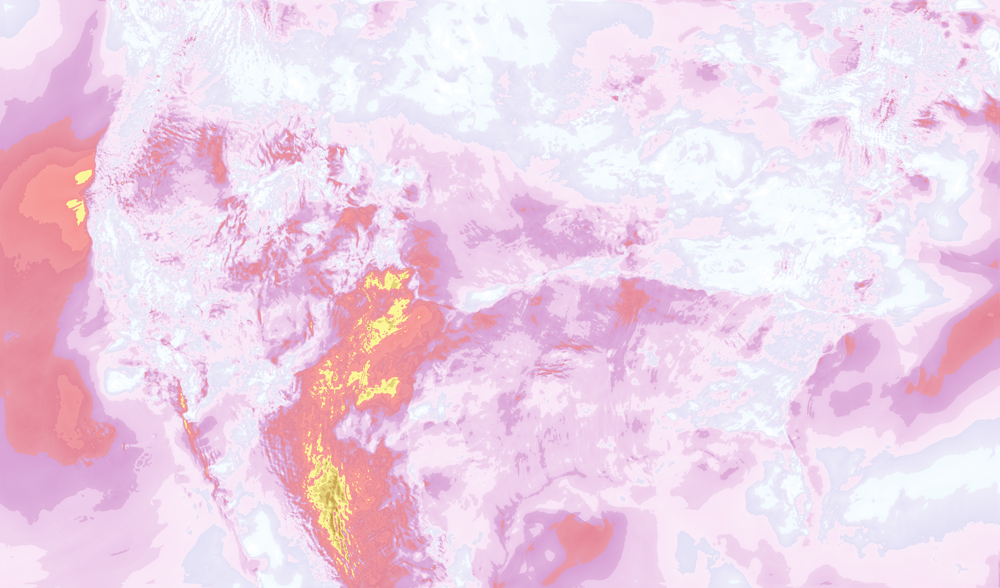
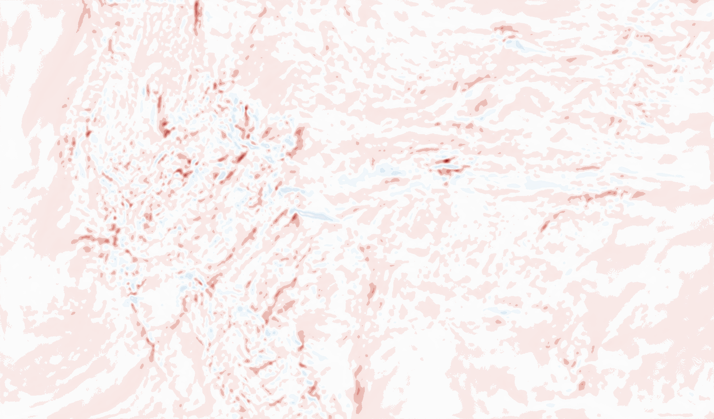
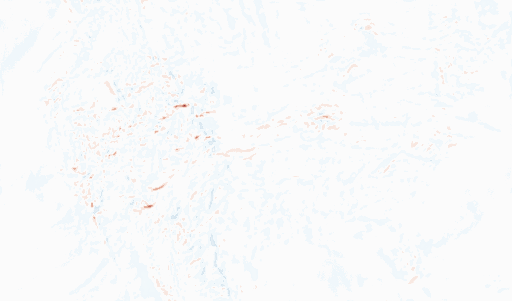
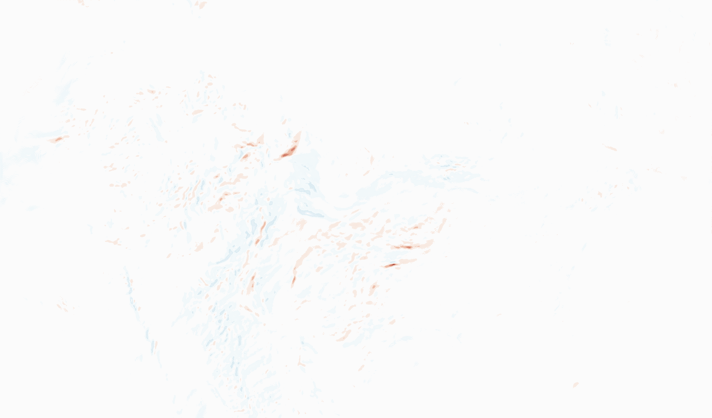
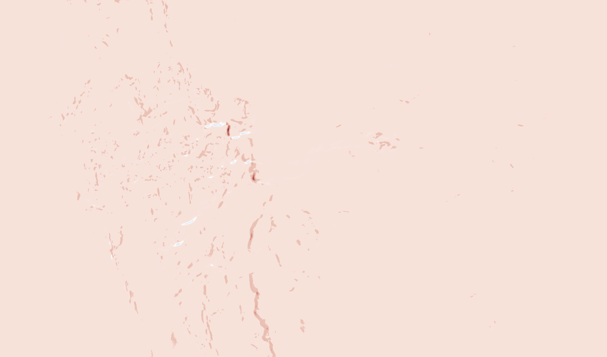
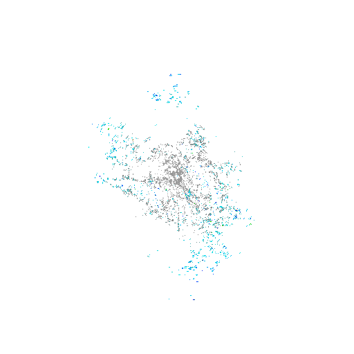

# rustbox Showcase

This page is the fastest visual tour of what `rustbox` can do today without reading the crate tree first.

## Current End-to-End Surfaces

- HRRR archive/core path: plan -> stage -> decode -> persist
- HRRR model-column diagnostics: parcel/severe from a decoded model profile
- HRRR batch mesoanalysis: derived 850 mb products from persisted stores
- Radar path: Level II parse -> inspect -> render -> detect

## 1. HRRR Model-Column Demo

Command:

```powershell
cargo run -p wx-cli -- demo
```

Current output:

```text
profile_point=x1798 y1058 levels=8 sfc_p=1018.4 top_p=300.0
sbcape=209.1 sbcin=-41.8 mlcape=0.0 mlcin=0.0 mucape=209.1 mucin=-41.8
srh01=11.4 srh03=47.4 shear06=18.30 stp_fixed=0.01
```

Artifact:



What this proves:

- real HRRR subset planning
- real GRIB2 decode
- fixed model-column extraction
- real parcel and severe diagnostics
- real transparent overlay rendering

## 2. HRRR Batch Mesoanalysis Demo

Command:

```powershell
cargo run -p mesoanalysis-app -- demo
```

Current products:

- `smoothed_vorticity_850mb`
- `divergence_850mb`
- `temperature_advection_850mb`
- `frontogenesis_850mb`

### Smoothed Vorticity



### Divergence



### Temperature Advection



### Theta Frontogenesis



What this proves:

- persisted archive-cycle Zarr stores can be read back into `FieldBundle`
- batch product registry and dependency mapping are real
- derived products can be persisted back to Zarr
- the render path supports multiple science products, not just one demo overlay

## 3. Radar Demo

Commands:

```powershell
cargo run -p radar-viewer-app -- inspect tests/fixtures/KATX20240101_000258_partial_V06
cargo run -p radar-viewer-app -- detect tests/fixtures/KATX20240101_000258_partial_V06
cargo run -p radar-viewer-app -- render tests/fixtures/KATX20240101_000258_partial_V06 REF target/demo/radar_reflectivity.png 0 512 classic default
```

Current inspect summary:

```json
{
  "summary": {
    "station_id": "KATX",
    "site_name": "Seattle",
    "sweep_count": 5,
    "products": ["CC", "PHI", "REF", "SW", "VEL", "ZDR"],
    "timestamp_utc": "2024-01-01 00:02:58 UTC"
  }
}
```

Current detection summary:

```json
{
  "station_id": "KATX",
  "mesocyclone_count": 0,
  "tvs_count": 0,
  "hail_count": 0,
  "storm_motion_direction_from_deg": 24.473654,
  "storm_motion_speed_kt": 0.45446494
}
```

Artifact:



What this proves:

- real Level II parsing
- real product inventory
- real derived-product and detection surface
- real PNG render export from radar data

## 4. Archive Workflow

Minimal archive smoke path:

```powershell
cargo run -p wx-cli -- archive-run 2024040100 2024040100 prs 0 target/archive-zarr-smoke "TMP|850 mb|anl" "TMP|700 mb|anl"
```

That path now does:

1. source probing
2. remote `.idx` fetch
3. byte-range staging
4. strict GRIB decode
5. bundle assembly
6. per-cycle Zarr persistence

Then `mesoanalysis-app -- run` can consume the persisted archive manifest and generate derived products over those stored cycles.

## 5. What Is Still Missing

The current showcase is real, but the platform is not fully closed yet.

- `wx-wrf` is still a stub
- `wx-py` is still a stub
- `open-wx-api-rs` is still a scaffold
- mesoanalysis is real but still a narrow first batch engine, not the full 46-parameter upstream surface

## 6. Fastest Local Tour

If you want to re-run the exact current showcase:

```powershell
cargo run -p wx-cli -- demo
cargo run -p mesoanalysis-app -- demo
cargo run -p radar-viewer-app -- inspect tests/fixtures/KATX20240101_000258_partial_V06
cargo run -p radar-viewer-app -- detect tests/fixtures/KATX20240101_000258_partial_V06
cargo run -p radar-viewer-app -- render tests/fixtures/KATX20240101_000258_partial_V06 REF target/demo/radar_reflectivity.png 0 512 classic default
```
